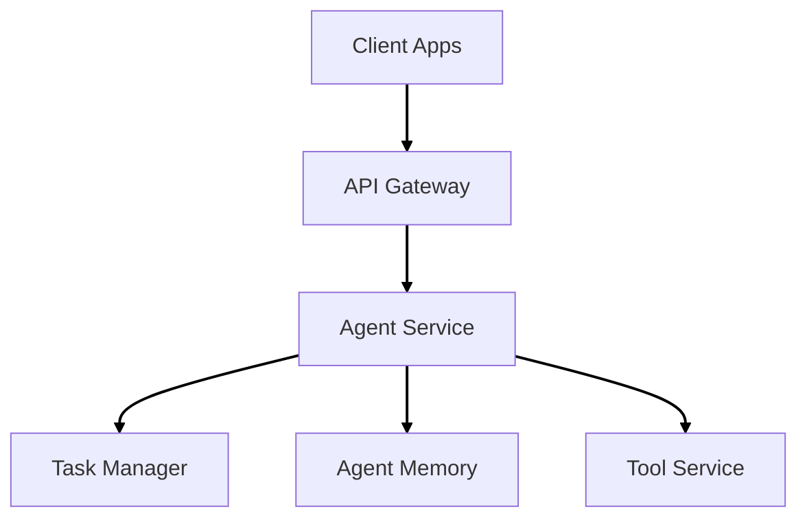

# AI Agent System

A flexible AI agent architecture supporting tool integration, sequence tracking, and business intelligence analysis. 

## Quick Start
# Setup environment
python setup.py

# Activate virtual environment
source venv/bin/activate  # Unix
.\venv\Scripts\activate   # Windows

# Configure environment
```
cp .env.example .env
# Edit .env with your settings
```

## Core Features

- Tool-agnostic agent architecture
- Decision chain tracking
- Power BI integration
- Structured logging
- Performance monitoring

## Architecture Overview  



## Development

- Python 3.10+
- FastAPI
- MongoDB
- Redis
- See requirements.txt for full list

## Documentation

See our [Wiki](wiki-link) for:
- Architecture details
- Development guides
- Configuration
- Monitoring setup

## License

[License Type]
